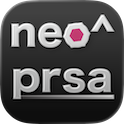

<div align="center">

  

  <h1>Neoprisma</h1>

  <p>
    Lightweight macro & autoclick utility for MacOS
  </p>

  <p>
    
    
    
    
    
    
  </p>

</div>

# Neoprisma / nprisma

Neoprisma is a simple, reliable, and open source autoclicker/macro utility for MacOS

For too long, sketchy, malware-infected TinyTask versions have ruled the internet in terms of automation. Neoprisma changes that.\
Neoprisma is open-source, so you can actually see the code you are running, meaning no more trusting random blobs you can't see the internals of. Additionally, the app works on Mac!\
Ironically, only MacOS is currently supported, however cross-platform support is a future goal. Neoprisma is an active project, and updates are released very frequently.

## Features

* ✅ Record & play back any keyboard and mouse inputs
* ✅ Save recordings to files and load them anytime
* ✅ Autoclick at high speeds 
* ✅ Fully configurable hotkeys
* ✅ Adjustable playback speeds

## Roadmap

| Feature | Done | Description |
| - | - | - |
| Autoclick | <ul><li>- [ ] </li></ul> | Delay can be adjusted, but only left clicking is supported. | 
| Tasks/Macros | <ul><li>- [x] </li></ul> | Record nearly any sequence of keyboard and mouse inputs. Adjustable playback speed. Tasks can be saved and loaded from files.  |
| Scripting/Full automation | <ul><li>- [ ] </li></ul> | Monitor and control the keyboard and mouse. Uses Lua; fully scriptable. More will be added to the API in the future |
| Interface | <ul><li>- [x] </li></ul> | Primarily system tray based, but has normal UI too. Features automatic update prompting, and dedicated settings window. Icon auto-hides from the dock. |
| Hotkeys | <ul><li>- [x] </li></ul> | Highly configurable. Bugs are still present, however they will be worked out sooner than later. |
| Installer | <ul><li>- [x] </li></ul> | Build from source or download precompiled bundles. The installer will do everything for you with helpful visuals along the way. |

## Installation

Neoprisma can be built from source or installed with its dedicated installer script.\
*Once the install finishes, grant Neoprisma "Input Monitoring" and "Accessibility" permissions in System Settings.*

Before running, inspect `install.sh` in the stable branch of this repository to make sure the code you are about to run is trustworthy. Only proceed if you are satisfied.

Install prebuilt bundle (recommended):
```bash
curl -fsSL https://raw.githubusercontent.com/PrismaticDepths/neoprisma/stable/install.sh | $SHELL
```


Build from source:
```bash
curl -fsSL https://raw.githubusercontent.com/PrismaticDepths/neoprisma/stable/install.sh | $SHELL -s  -- -s YES
```

### Installer Flags

**It's not necessary to pass any options.**\
For options with argument YES/NO, anything other than NO will trigger them. Passing NO has the same behaviour as ommitting the flag entirely. The reason for this odd behaviour is that it's required to pass an argument for every flag -- fixing this would be time consuming and there isn't actually any real problem with this behaviour anyways.

```
-b BUILD_DIR (Set a different build directory. Absolute paths are recommended.)
-i INSTALL_DIR (Set a different install directory. Absolute paths are recommended.)
-r BRANCH (Clone from a different branch if building from source, such as 'main'.)
-y YES/NO (Runs in non-interactive mode and automatically accepts all prompts)
-s YES/NO (Build from source and do not attempt to download a bundle)
---
Example:
curl -fsSL https://raw.githubusercontent.com/PrismaticDepths/neoprisma/stable/install.sh | $SHELL -s  -- -s YES -y YES -r main
This would build from source, skip any prompts, and build from the main branch instead of the stable one.
```


### Caveats

| Permissions |
| - |
| Neoprisma requires *"Input Monitoring"* and *"Accessibility"* permissions to operate. You must re-grant these permissions every time you install or update Neoprisma. |
| *"Input Monitoring"* allows Neoprisma to monitor keyboard input. This is used for hotkeys, and the recording of tasks. |
| *"Accessibility"* allows, among other things, for Neoprisma to control your mouse and keyboard. This is used for autoclicking and playing back tasks. |
| You can grant these permissions in the "Privacy & Security" section of System Settings. |

## Hotkeys / Usage

Hotkeys are configurable in the settings menu.

| Default Keybind | Action |
| - | - |
|`<ctrl><fn><f7>` | toggle recording |
|`<ctrl><fn><f8>` | toggle autoclicker |
|`<ctrl><fn><f9>` | toggle playback |

You can reset hotkeys and other configuration data by deleting the hidden file named `.neoprisma` in your home directory. To show hidden files, you can use the keyboard shortcut `<cmd>+<shift>+<.>` in Finder.

## Scripting

Neoprisma supports custom extensions (user written scripts) through a Lua API. You can run and monitor scripts through the scripts menu.

> From here on out these scripts will probably be referred to as "user scripts". Do what you will with this info.

The syntax for Neoprisma's Lua API is somewhat similar to that of Roblox's. You can connect functions to events (eg. onKeyPressed) and then they will be fired accordingly.

This allows you to automate quite a lot, more than what recording and playing input back would do.

### Security

Scripts are run using Lupa and sandboxed for security. You can also toggle event hooks in settings if you want to save CPU or don't want a script to monitor your keypresses.

Certain Lua builtins are not available to user scripts (sandboxing). This includes `os`, `io`, `package`, `debug`, `require`, and `module`. All attributes of Python objects which start or end with an underscore (`_`, eg. `__self__`) are protected and cannot be read or written to.

Additionally, a confirmation/warning prompt shows before scripts are ran. *This cannot be disabled.*

### Info

A lot of the Neoprisma-defined functions and their arguments can be found in `src/automation.h`. However, that is not a complete list. If you'd like a definite complete list, check `src/ext_scripting_macos.py`.  The classes made accessible to user scripts will have names starting with "LUA".

A list of functions and objects is also provided below. It should hopefully be up to date. (If you think this reference is missing something, now you know where to look.)


### API

> **[ℹ]** **Notice**\
> Since Neoprisma implements its own log functions, the builtin lua `error` and `warn` objects have been renamed to `_error` and `_warn` respsectively. Additionally, the standard `print()` function does not print to the Script Log.

> **[ℹ]** **Notice**\
> Many of the below functions enforce strict typing. Simply passing a float instead of an integer *can* and *will* raise an error.

```py
# The API, with objects replaced by stubs or simplified for brevity. This would be turned into a Lua object by Lupa.

#
# class Signal: 
#
#  def connect(func:function): ...
#  def fire(*args): ... # Note - Fires all connected functions
#

class Neoprisma:

  class Keyboard: # Functions for controlling and monitoring the keyboard

    onKeyPressed: Signal = ... # signal, passes vk:int
    onKeyReleased: Signal = ... # signal, passes vk:int
    def keyStatus(vk:int,status:bool): ... # presses or releases a key by vk

  class Mouse: # Functions for controlling and monitoring the mouse

    onMouseDown: Signal = ... # signal, passes button:int,x,y - fires on mouse pressed
    onMouseUp: Signal = ... # signal, passes button:int,x,y - fires on mouse released
    onMouseMoved: Signal = ... # signal, passes x,y
    onMouseScrolled: Signal = ... # signal, passes x,y,dx,dy
    def moveMouseAbsolute(x:int,y:int): ...
    def warpMouseAbsolute(x:int,y:int): ...
    def dragMouseAbsolute(button:int,x:int,y:int): ...
    def mouseButtonStatus(button:int,x:int,y:int,status:bool): ...
    def mouseButtonStatus(button:int,status:bool): ...
    def mouseScroll(x:int,y:int,dx:int,dy:int): ...

  class Clock: # Functions for monitoring time

    def time(): ... # Equivalent to Python's time.time() 
    def sleep(): ... # Sleeps the current QThread. DO NOT USE THIS IN SIGNAL CALLBACK!
  
def info(text:str): ... # Prints to the Neoprisma script log.
def warn(text:str): ... # Prints to the Neoprisma script log in yellow text.
def error(text:str): ... # Prints to the Neoprisma script log in red text. (Doesn't actually raise an error though.)
```

### Example Scripts

```lua
-- src/assets/wasd-to-arrows.lua
--
-- This script hits arrow keys accordingly when you press WASD. For example, if you hit W, it would press the up arrow.

local allow = { -- Which keypresses we want to trigger our logic for (in this case these are the WASD keys)
	[0] = true,
	[1] = true,
	[2] = true,
	[13] = true
}

local convert = { -- Map WASD keycodes to arrow key keycodes
	[0] = 123,
	[2] = 124,
	[1] = 125,
	[13] = 126
}

Neoprisma.Keyboard.onKeyPress.connect(function(vk)
 if allow[vk] then -- Is this key in the allow list?
	Neoprisma.Keyboard.keyStatus(convert[vk],true) -- Press the key's equivalent vk in the convert table
 end
end)

Neoprisma.Keyboard.onKeyRelease.connect(function(vk)
 if allow[vk] then -- Is this key in the allow list?
	Neoprisma.Keyboard.keyStatus(convert[vk],false)  -- Release the key's equivalent vk in the convert table
 end
end)
```

### Notes

#### Argument Injection

Some functions, eg. signal `connect()` functions, require a `ext_scripting_<platform>.Script` object passed as their last argument. This is for internal reasons, and allows Neoprisma to track things like a script's number active hooks, its status, and more. Having to pass an arbitrary variable every time you call specific function is obviously not very elegant, and generally will make things more confusing for users.

To solve this, Neoprisma wraps those functions and silently injects the argument behind the scenes, so that you don't need to do it yourself. (Knowing this doesn't really affect the user experience for scripts, it's just fun trivia.)

## Known Issues

Hotkeys used to toggle recording are written into recordings. Neoprisma has safeguards to prevent any hotkeys contained in recordings from activating anything within itself, however if a hotkey in a recording conflicts with a hotkey from a different app, there is no guarantee that said app will ignore it. I plan to address this later, and also add suppression so that hotkeys won't also go to other apps when you trigger them.

Hotkeys sometimes become unresponsive. The only solution I have found to this is to spam all of the hotkeys. \
(This seems to have been fixed in later versions.) \
Alternatively, the "Abort Playback On Input" setting can be used, which will stop playback if you press a key. The apps own inputs should not trigger this.
You can also use the command-tab switcher to go to Neoprisma and quit it with `<command>+<q>` if you need.

## Performance

When idle, CPU usage and RAM are very low. However, CPU usage spikes upon mouse movement and keyboard activity, to about 10% of a single core (tested on an M3 Pro). Neoprisma isn't actually optimized for either, and mostly optimized for accurate playback, however there is room to improve here and hence this will probably be improved someday.

When testing with a recording of Geometry Dash gameplay (Stereo Madness), Neoprisma didn't do the best, getting as far as the middle of the first ship section after several tries. This was with an early version of Neoprisma; I have yet to see if there is any difference on later versions.

Setting the process priority to 20 may help.

## Acknowledgements

Thank you to @xbytz for helping to port the majority of the C++ portion of the app to Windows.
